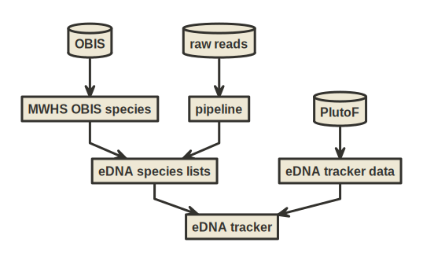

# edna-tracker

<https://samples.ednaexpeditions.org/>

## Data sources

- <https://github.com/iobis/edna-tracker-data>
- <https://github.com/iobis/mwhs-obis-species>
- <https://github.com/iobis/edna-species-lists> (private)
